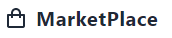

[![Contributors][contributors-shield]][contributors-url]
[![Forks][forks-shield]][forks-url]
[![Stargazers][stars-shield]][stars-url]
[![Issues][issues-shield]][issues-url]
[![MIT License][license-shield]][license-url]
[![LinkedIn][linkedin-shield]][linkedin-url]


<!-- PROJECT LOGO -->
<br />
<p align="center">
  <a href="https://github.com/YassineCherkaoui/APPLICATION-MARKETPLACE-MEDICAL-REPRESENTATIVE">
    
  </a>

  <h3 align="center">APPLICATION-MARKETPLACE-MEDICAL-REPRESENTATIVE</h3>

  <p align="center">
    MarketPlace (Délégué Médical) Using React And Nodejs / API 
    <br />
    <a href="https://github.com/YassineCherkaoui/APPLICATION-MARKETPLACE-MEDICAL-REPRESENTATIVE"><strong>Explore the docs »</strong></a>
    <br />
    ·
    <a href="https://github.com/YassineCherkaoui/APPLICATION-MARKETPLACE-MEDICAL-REPRESENTATIVE/issues">Report Bug</a>
    ·
    <a href="https://github.com/YassineCherkaoui/APPLICATION-MARKETPLACE-MEDICAL-REPRESENTATIVE/issues">Request Feature</a>
  </p>
</p>


<!-- TABLE OF CONTENTS -->
<details open="open">
  <summary>Table of Contents</summary>
  <ol>
    <li>
      <a href="#about-the-project">About The Project</a>
      <ul>
        <li><a href="#built-with">Built With</a></li>
      </ul>
    </li>
    <li>
      <a href="#getting-started">Getting Started</a>
      <ul>
        <li><a href="#prerequisites">Prerequisites</a></li>
        <li><a href="#installation">Installation</a></li>
      </ul>
    </li>
    <li><a href="#usage">Usage</a></li>
    <li><a href="#roadmap">Roadmap</a></li>
    <li><a href="#contributing">Contributing</a></li>
    <li><a href="#license">License</a></li>
    <li><a href="#contact">Contact</a></li>
    <li><a href="#acknowledgements">Acknowledgements</a></li>
  </ol>
</details>


<!-- ABOUT THE PROJECT -->
## About The Project

[![admin][admin]](https://github.com/YassineCherkaoui/APPLICATION-MARKETPLACE-MEDICAL-REPRESENTATIVE)


[![chat][chat]](https://github.com/YassineCherkaoui/APPLICATION-MARKETPLACE-MEDICAL-REPRESENTATIVE)

[![exchange][exchange]](https://github.com/YassineCherkaoui/APPLICATION-MARKETPLACE-MEDICAL-REPRESENTATIVE)

[![sellerdash][sellerdash]](https://github.com/YassineCherkaoui/APPLICATION-MARKETPLACE-MEDICAL-REPRESENTATIVE)

[![statistic][statistic]](https://github.com/YassineCherkaoui/APPLICATION-MARKETPLACE-MEDICAL-REPRESENTATIVE)


# APPLICATION-MARKETPLACE-MEDICAL-REPRESENTATIVE
MarketPlace (Délégué Médical) Using React And Nodejs / API 

# Contexte du projet

MarketPlace est une plateforme en ligne pour la vente de plusieurs produits par plusieurs vendeurs. On a besoin de développer une plateforme en ligne appelée « MarketStore » MultiLangue (Fr/Eng) MarketStore sera organisée en 4 parties FrontOffice (Client) et BackOffice(Vendeur) Backoffice (SuperAdmin) Backoffice(Admin)

# BackOffice (SuperAdmin):

On a un seul SuperAdmin qui peut confirmer chaque inscription d’un vendeur par un document administratif

Il peut désactiver le compte d’un vendeur

Il peut ajouter plusieurs admin

# BackOffice(Admin)

Chaque Admin peut confirmer les commandes reçues par les clients

S’il y a des problèmes de livraison ou de retour, il peut contacter les clients par email ou par téléphone

Il peut ajouter des livreurs Standard (Livraison de 5 jours) Livreurs Express (1 jour)

# BackOffice(Vendeur)

Pour vendre sur MarketStore, le vendeur doit être enregistré et validé par le Super Admin Lors de son inscription, il doit envoyer un document justificatif de l’identité fiscale

Il y a 3 types de vendeur (Starter, Pro et Expert)

Par défaut le compte d’un vendeur est Starter est limité à 10 produits différents avec Livraison Standard

Compte Pro : permet de vendre 50 produits Livraison Standard

Compte Expert : Vente des produits en illimité et il propose une Livraison Express par MarketStore

Si le vendeur génère plus de 5000 Dhs de chiffre d’affaire elle passe directement au compte Pro

Si le vendeur génère plus de 20 000 Dhs de chiffre d’affaire elle passe directement au Compte Expert

Si le vendeur souhaite acheter un Pack sans Générer un chiffre d’affaire, il peut procéder au moyen de paiement (Virement Bancaire ou Paiement par Carte)

Le prix d’un compte Pro : 3000 dhs

Le prix d’un Expert : 5000 dhs

Pour ajouter un produit sur MarketStore, il faut préciser 2 devises minimums, la devise par défaut et le MAD (Api)

# FrontOffice en MonoPage(Client)

Sur la page d’accueil du client, on consulte les produits les plus populaires et les meilleures ventes

Le client peut choisir les produits catégories

Le client peut switcher entre les langues (Fr /Ang)

Le client peut choisir la devise qu’il veut

Le client peut filtrer les produits par Prix, Date, Marque (s’il y en a)

Pour passer une commande le client doit être inscrit, il doit valider son inscription par le clic sur l’email de validation envoyé sur sa boite email

Le client peut démarrer une discussion whatsapp avec l’admin de MarketStore

Chaque commande passée par le client doit être validé par l’admin

Pour payer une commande, le client a le choix de payer à la livraison ou en ligne via une solution comme Paypal (Api) ou Stripe(Api)

# Travail demandé

• Développer la plateforme MarketStore en utilisant une base de donnés MongoDb

• Développer l’Api en Node Js en respectant les couches MVC

• Ajouter les tests unitaires adéquats à vos méthodes

• Ajouter les Logs pour chaque commande validée

• Développer la partie FrontEnd en utilisant ReactJS comme les Hooks, Fragments, React Router

• Pour éviter les attaques XSS, essayer d’utiliser les validations des attributs au niveau Back end + les expressions régulière)

• Ecrire un script de déploiement de l'application (serveur Heroku ou autre)

Réaliser le Diagramme de Classe relatif à la création de la MarketPlace

### Built With

j'ai construit cette application avec

* [HTML5]()
* [Node.js]()
* [MongoDB]()
* [Bootstrap]()
* [Git]()
* [JavaScript]()
* [UX]()
* [CSS3]()
* [Pédagogie active]()
* [UML]()


<!-- GETTING STARTED -->
## Getting Started

to get Started please follow this Prerequisites :)

### Prerequisites


* npm
  ```sh
  npm install npm@latest -g
  ```

### Installation

1. go to repo https://github.com/YassineCherkaoui/APPLICATION-MARKETPLACE-MEDICAL-REPRESENTATIVE
2. Clone the repo
   ```sh
   git clone https://github.com/YassineCherkaoui/APPLICATION-MARKETPLACE-MEDICAL-REPRESENTATIVE
   ```
3. Install NPM packages
   ```sh
   npm install
   ```
4. Install NPM packages
  go to "Client" 
   ```sh
   npm install
   npm start
   ```
4. Install NPM packages
  go to "Server" 
   ```sh
   npm install
   nodemon ./SERVER.js
   ```


<!-- USAGE EXAMPLES -->
## Usage

Use This application as a Marketplace (Délégué Médical) 


<!-- ROADMAP -->
## Roadmap

See the [open issues](https://github.com/YassineCherkaoui/APPLICATION-MARKETPLACE-MEDICAL-REPRESENTATIVE/issues) for a list of proposed features (and known issues).


<!-- CONTRIBUTING -->
## Contributing

Contributions are what make the open source community such an amazing place to be learn, inspire, and create. Any contributions you make are **greatly appreciated**.

1. Fork the Project
2. Create your Feature Branch (`git checkout -b `)
3. Commit your Changes (`git commit -m `)
4. Push to the Branch (`git push origin `)
5. Open a Pull Request


<!-- LICENSE -->
## License

Distributed under the MIT License. See `LICENSE` for more information.


<!-- CONTACT -->
## Contact

YASSINE CHERKAOUI - [@CherkaouiYa](https://twitter.com/CherkaouiYa) - yassin.cherkaoui2000@gmail.com

Project Link: [https://github.com/YassineCherkaoui/APPLICATION-MARKETPLACE-MEDICAL-REPRESENTATIVE](https://github.com/YassineCherkaoui/APPLICATION-MARKETPLACE-MEDICAL-REPRESENTATIVE)


<!-- ACKNOWLEDGEMENTS -->
## Acknowledgements
* [GitHub Emoji Cheat Sheet](https://www.webpagefx.com/tools/emoji-cheat-sheet)
* [Img Shields](https://shields.io)
* [Choose an Open Source License](https://choosealicense.com)
* [GitHub Pages](https://pages.github.com)
* [Animate.css](https://daneden.github.io/animate.css)
* [Loaders.css](https://connoratherton.com/loaders)
* [Slick Carousel](https://kenwheeler.github.io/slick)
* [Smooth Scroll](https://github.com/cferdinandi/smooth-scroll)
* [Sticky Kit](http://leafo.net/sticky-kit)
* [JVectorMap](http://jvectormap.com)
* [Font Awesome](https://fontawesome.com)


<!-- MARKDOWN LINKS & IMAGES -->
<!-- https://www.markdownguide.org/basic-syntax/#reference-style-links -->
[contributors-shield]: https://img.shields.io/github/contributors/othneildrew/Best-README-Template.svg?style=for-the-badge
[contributors-url]: https://github.com/YassineCherkaoui/APPLICATION-MARKETPLACE-MEDICAL-REPRESENTATIVE/graphs/contributors
[forks-shield]: https://img.shields.io/github/forks/othneildrew/Best-README-Template.svg?style=for-the-badge
[forks-url]: https://github.com/YassineCherkaoui/APPLICATION-MARKETPLACE-MEDICAL-REPRESENTATIVE/network/members
[stars-shield]: https://img.shields.io/github/stars/othneildrew/Best-README-Template.svg?style=for-the-badge
[stars-url]: https://github.com/YassineCherkaoui/APPLICATION-MARKETPLACE-MEDICAL-REPRESENTATIVE/stargazers
[issues-shield]: https://img.shields.io/github/issues/othneildrew/Best-README-Template.svg?style=for-the-badge
[issues-url]: https://github.com/YassineCherkaoui/APPLICATION-MARKETPLACE-MEDICAL-REPRESENTATIVE/issues
[license-shield]: https://img.shields.io/github/license/othneildrew/Best-README-Template.svg?style=for-the-badge
[license-url]: https://github.com/YassineCherkaoui/APPLICATION-MARKETPLACE-MEDICAL-REPRESENTATIVE/blob/master/LICENSE.txt
[linkedin-shield]: https://img.shields.io/badge/-LinkedIn-black.svg?style=for-the-badge&logo=linkedin&colorB=555
[linkedin-url]: https://linkedin.com/in/othneildrew


<!-- SCREENSHOOT -->

[admin]: images/admin.png

[exchange]: images/exchange.png

[sellerdash]: images/sellerdash.png

[statistic]: images/statistic.png

[SuperAdmin]: images/SuperAdmin.png

[chat]: images/chat.png

[logo]: images/logo.png